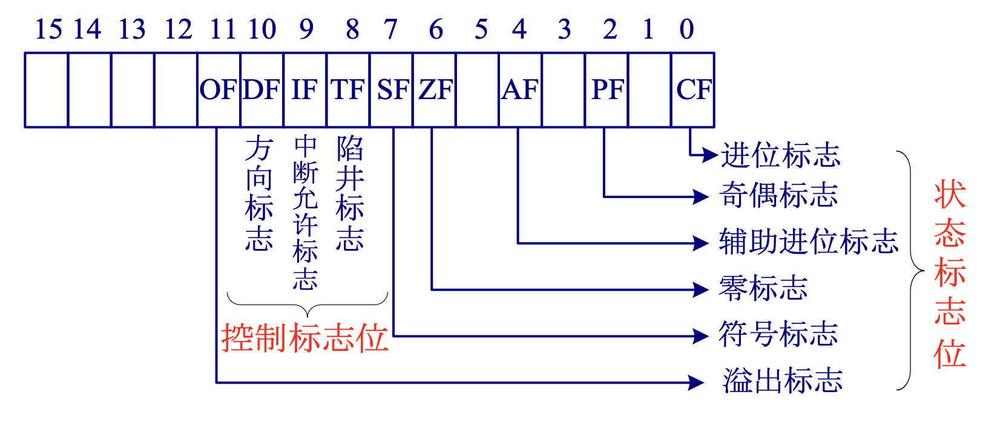
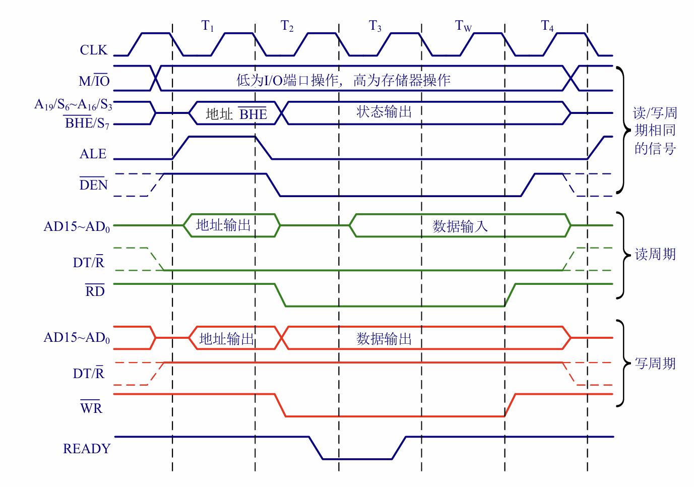
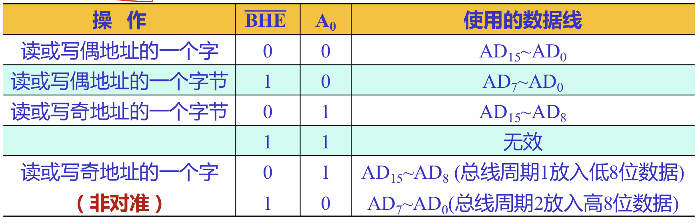
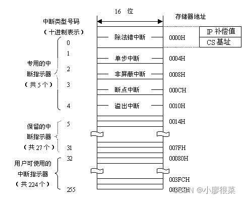

**8086**:
- 16数据总线 20地址总线 
- 2级流水线
- 内部结构：EU + BIU
- BIU内指令队列有6Byte
- 存储器分段管理：代码、数据段、堆栈段、附加段

**标志寄存器**

PF是低八位有偶数个1为1 否则为0

**CF、OF**

首先需要指出，计算机在进行add，sub中并不区分有符号数还是无符号数，但是能给出对应的cf，of。两个数的用法取决于用户。
cf代表无符号数的溢出，of代表有符号数的溢出。
我们约定计算减法遵从将减数取反后转换成加法
这样的话of的计算是一样的，可以把符号位写成两位，0->00 1->11，最后出来符号位为11/00 of=0，01/10 of=1。
但是比较搞的是cf在加减法上会反掉，简而言之是，加法里还是进位cf为1，但是减法里变成进位cf=0.

所以更好的方法我感觉是换成十进制，判断cf的时候当成无符号数，判断of的时候当成有符号数，算出来看看结果会不会爆范围，这个应该是最好记的。

**总线周期（机器周期）**

包含>=4个时钟周期，可以划分为T1，T2，T3（中间有Tw）T4
具体每个T干什么不太好说明，主要读写操作在T2不太一致。

---

**8086引脚**
**DT/R**
为1时cpu向外发数据 为0时cpu接收数据

**ALE&DEN&BHE（时序，分时复用）**

ALE高电平有效，利用其下降沿，可以在T1结束时把地址锁存
DEN低电平有效，有效期间可以使用数据总线传输数据，一般在T2-T4之间（即T3，Tw）有效
这里就涉及到AD0-15，A16-A19/S3-S6的分时复用，AD0-15在ALE=1时用作地址总线，在DEN=0时用作数据总线，而A16-19在T1用于传递地址，后续用于传递状态 状态含义见第二章p22

另外 8086一共有21根线分时复用，上面一共20根，还有一个BHE/S7，BHE在T1有效，0表示高八位有效，1为高八位无效
谈到BHE就不得不讨论8086如何读取存储空间中的字和字节。我们知道是由BHE和A0共同控制的

8086是用两个存储芯片共同表示一个字（两个字节）想象一下，给出一个地址220h，此时A0=0，我们能找到的是220、221处两个字节（原因在于片内选址只与A0以外的地址线有关，A0改一改就可以找到另一片存储芯片），BHE=0我就把221处的字节也带上，BHE=1就只传递220处字节。
可是A0=1时，我能找到的字节其实还是220h，221h。由于8086的存储特性，我没法找到222h，这个要变动A1了。所以这个时候BHE=1是无法实现的，我没有办法再找出这个高八位的下一个字节222h了。
所以，代码上mov [220h],ax和mov [221h],ax都是一行，但是前者只要一个总线周期，后者要两个总线周期

**HOLD&HLDA**
外部通过hold输入接管总线的请求 cpu释放三条总线，hlda返回确认

---

**汇编语言**

- 两种基本语句：指令性语句、伪指令语句（指示性语句）
- 两者区别：前者汇编时有对应机器指令，后者无对应的机器指令，不过可完成一系列功能
- 程序结构：顺序结构、分支结构、循环结构、子程序

---

**存储器**

- 工艺分类：mos/双极型
- 应用角度分类：RAM（SRAM、DRAM）/ROM（EPROM 2764、EEPROM、FLASH）
- FLASH：非易失型，NOR（速度快，存储代码）、NAND（大容量）

**存储器与cpu连接**

- 三种扩展设计：位扩展、字扩展、字位扩展
- 片选信号的产生：线选法、部分译码法、全译码法

解释一下扩展方法，比如位扩展，就是我一个片选信号一次选中多个芯片，分别提供一个字的不同位，比如2个1k * 4bit->1k * 8bit，那字扩展就是简单的堆叠芯片，用高位地址线片选，增加字数，比如2个1k * 4bit->2k * 4bit，同时扩展就是两者结合，高位信号片选，一次选中多个存储器，一同提供一个字，比如4个1k * 4bit->2k * 8bit。

---

**中断**

- 分类：硬件中断（外部中断）、软件中断（内部中断）
- 硬件中断分为可屏蔽中断INTR、不可屏蔽中断NMI
- 中断向量表：中断向量表安排在内存的前1KB，即00000H~003FFH，每个服务程序入口地址CS:IP占用4个字节（256*4＝1KB），高字节存放段地址CS，低字节存放段内偏移IP，按中断类型号顺序存放
- IF、TF的变化：IF表示是否响应**外部**中断，TF表示单步执行，不论外部中断还是内部中断，进入中断服务程序之前，都会把IF，TF置零，进入中断服务程序后，如果允许中断嵌套，把IF置1开中断，否则不动，不过内部中断没法用IF屏蔽，应该是一定会被响应
- 中断类型号获取&如何响应外部中断：获取中断类型号时，外部中断会复杂一些，需要一并考虑cpu响应外部中断的过程。
cpu会在每条指令最后一个总线周期的最后一个时钟周期采样**INTR**，若开中断，就会响应中断，向外设发送两个**INTA**，外设将在第二个脉冲来临时向cpu发送中断类型号
  
场景 | 类型号来源 | 特点
| --- | ---- | ------- |
内部中断（异常）& 外部中断NMI | CPU内部固定 | 硬件自动确定
外部中断（如8259A） | 由外设送出 | 通过数据总线读取
软件中断（INT n） | 指令直接指定 | 程序员手动设定

- 中断优先级：在多个中断同时到来时，先响应高优先级，在中断嵌套时，开中断条件下，只有高优先级能打断低优先级

---

**寻址**

感觉比较关键的点是存储器寻址时缺省的段寄存器
- 立即寻址 寄存器寻址（没什么）
- 直接寻址：默认DS 如[1000h]也可指定段寄存器
- 寄存器间接寻址：[BX/BP/DI/SI] 其中BP默认SS，BX/DI/SI默认DS
- 寄存器相对寻址：[BX/BP/DI/SI+imm/var] 缺省段寄存器和寄存器间接寻址一样
- 基址变址寻址：[BX/BP+DI/SI] BP默认SS，BX默认DS
- 相对基址变址寻址：[BX/BP+DI/SI+imm/var] 缺省同上
- IO寻址：这个很蠢 端口的地址空间其实有16位，独立于内存地址，数据位数可以8位可以16位。端口地址可以用立即数指定，但是立即数只能指定8位，用寄存器DX传递可以传递16位，从端口读出/写入的数据可以是8位AL或16位AX。格式IN AL/AX,DX/imm8  OUT DX/imm8,AL/AX **而且只能用AL/AX/DX**

---

**零散想法**

- 调用call入栈2/4个字节 （CS，若远转移）、IP
  调用int入栈6个字节 FLAG、CS、IP
- CPU在访问存储器进行读写操作时，通常在T3状态检测READY信号。若检测到READY无效（表示存储器或外设未准备好），则会在其后插入一个等待周期（Tw）
- int n n越小级别越高
- 重要ascii码：0：30h 1：31h 9：39h A：41h a：61h

