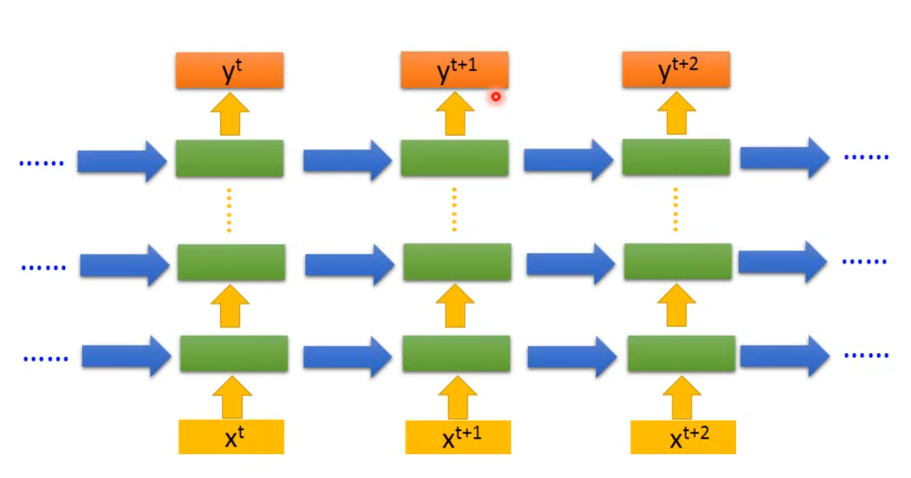
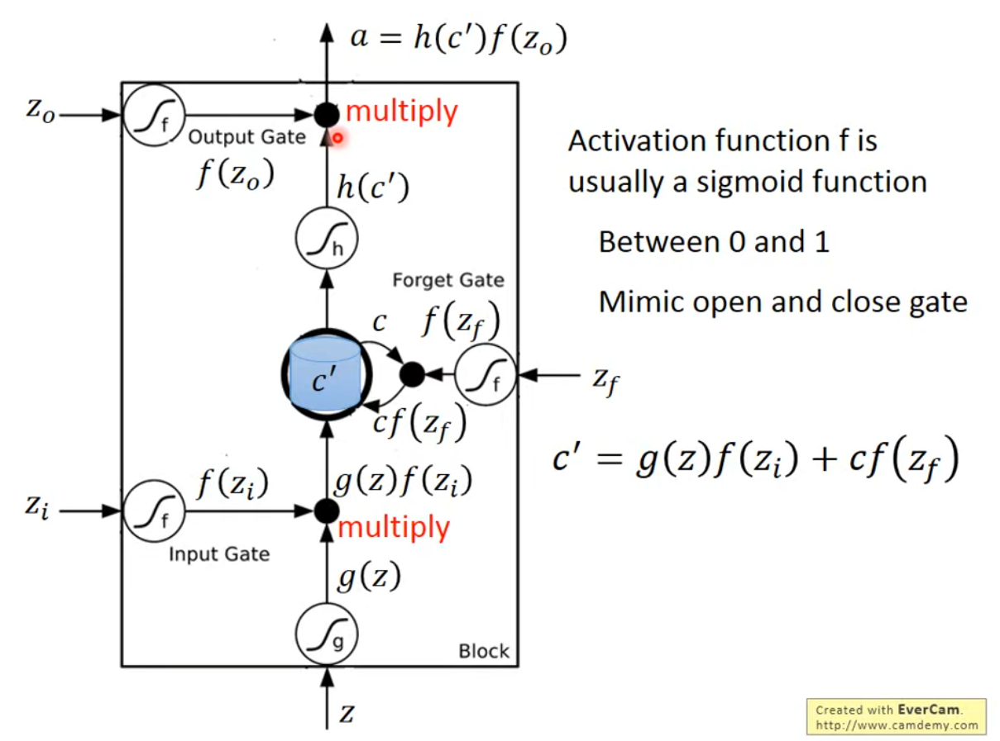

## RNN

和引入self-attetion是一样的情景，问题还是在于针对单一输入的network无法区别不同context下同一输入的不同含义

RNN的想法是让network有memory，

deep network加上rnn的思想之后就是这样（elman network） 每一层的输入还会加上上一个时间点上这一层的输出

## LSTM

long short-term memory
4个input 一个output 三个分别控制input gate, forget gate, output gate, activation function就通常是sigmoid（0/1）
