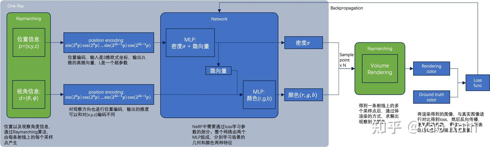
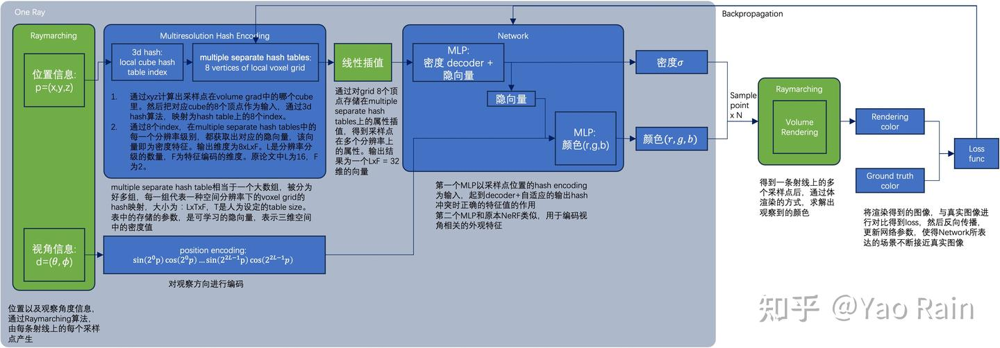

见这篇文章的整理 [从NeRF到Instant-NGP](https://zhuanlan.zhihu.com/p/631284285)
以及视频[论文分享：Instant-NGP](https://www.bilibili.com/video/BV1XG411m77R/?spm_id_from=333.1387.favlist.content.click&vd_source=4e3132b452f7579391b70a8a0daa30a1)

## Nerf

我自己其实觉得nerf的想法很简单，之前难以理解的问题可能在输入输出的理解不太明确，但是稍微了解一点图形学的知识后我觉得就比较明确。
nerf所训的神经网络，应该就是后续instant ngp的nerual gragphic primitives，其实也很类似纹理场的意义，本质都是把图像、模型压缩到神经网络中隐式表达，然后用坐标之类的信息去查询这个场，最后渲染出输出。
那么回到nerf，用于查询的输入就是一个查询点的位置(x,y,z)和观察方向$(\theta, \phi)$，在nerf中网络是用简单的mlp组成的，输出就是查询点的rgb和不透明度。
那么我们从一个摄像机出发，按照某个观察方向确定的一条射线上采样很多个点，查询这些点的输出，经过体渲染就得到最后图上的一个点的颜色。

几个关键点：
- 体渲染的过程（一个积分）是可微的，所以回溯的时候梯度就可以传回去
- 网络输入时不是一次性输入五维的输入，而是先输入xyz再输入方向，insight在于一个点的密度（不透明度也好，$\sigma$ 也好），是与观察角度无关的，换言之：$$\sigma = MLP1(x,y,z)$$ 而这个点被观察到的颜色是与这个点的观察方向有关的，即：$$color = MLP2(feature_{from MLP1}, d)$$ d为观察角度的位置编码
- 位置编码在mlp的训练过程是重要的，在nerf中用的是比较简单的三角函数形式把位置和角度编码到高维空间，思想是mlp通常只能学习到低频信息，但是高维度上的低频信息在低维度上未必是低频的。
- nerf为什么慢，nerf中间的mlp的维度基本都会上升到256、512这样高维度，向前传播一次就会迭代整个网络的参数，这样庞大的网络训练起来注定是缓慢的

## Instant-NGP

instant ngp对nerf在原理上没有其他什么大改动，关键就是处理了上面的最后一个问题，加快了nerf的训练。
观察pipline其实动的地方只有一个，就是对xyz的编码处理。
nerf中处理位置的MLP是非常庞大的，也是极其缓慢的。
instant-ngp的手法是**multi-resolution encoding**，把空间分解成不同分辨率的一系列网格，原始空间中一个点的位置编码由不同分辨率的网格共同得出，具体的说，这个点在每个网格中可以找到一个对应的cube，用cube的八个顶点插值出这个点在这个分辨率下的feature，不同分辨率下的feature concat起来就是最终的编码。
但是这种方式的存储压力极大（随分辨率成三次方增长），但是**存储空间换来的是计算效率**，这样做之后，后续的mlp可以开的很小。而且，**虽然我存了很多参数，但是我每次梯度回传只会涉及到小型mlp的参数和一个空间点对应的cube上的feature的参数（比如一条ray上才128个点，只会动哈希表里128 * 8 * feature_size个参数），这个计算量远小于forward一次就要动整个大mlp的全部参数的Nerf** 这一点比较关键，因为单从参数量看不出instantngp的优势，甚至比nerf还大很多，但是我运算其实只涉及到其中一点点参数。
instant-ngp的另一个insight是，我其实用不到高分辨率下的所有网格，也就是我对空间中这么多点的利用其实是稀疏的。所以我给所有分辨率下的网格各自分配一个固定大小的hashtable，网格上点的feature从这个hashtable里面搜取，这样带来的显然的问题是，网格上的点多于哈希表的大小时就会冲突，但是由于稀疏性，我不关心这一点。
这样就限制了存储空间不会太夸张，同时也实现了muti-resolution对运算速度的优化，也就是论文的核心**Multiresolution hash encoding**