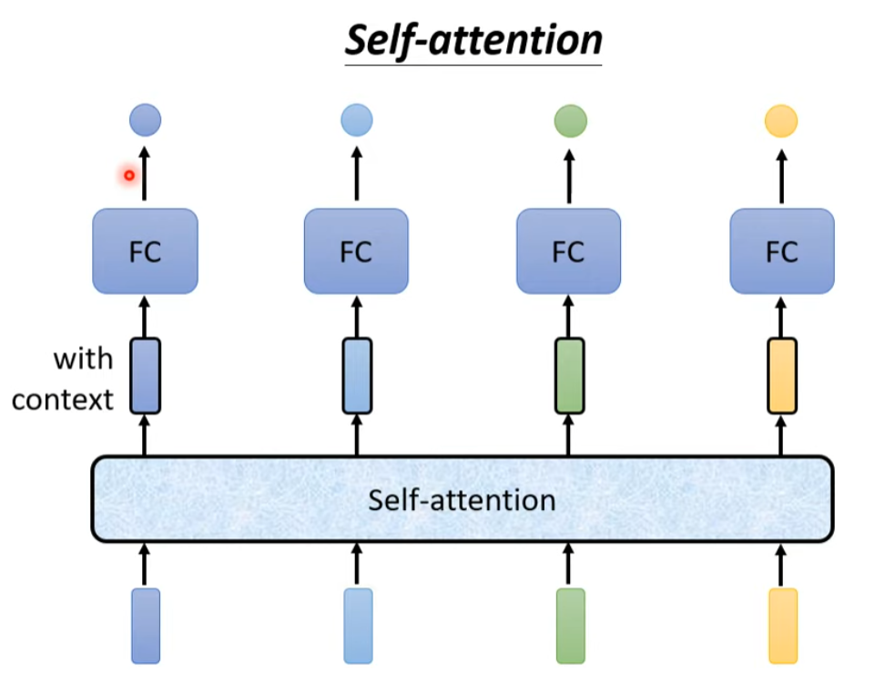

## self attention

**动机**：考虑一个问题，n个输入，n个输出，我们需要得到这个函数，似乎就是一个Linear可以解决的问题，但是如果问题背景具体到如下：

此时我们想要判别单词的词性，那我们发现Linear不可能区分出第二个saw和第三个saw的差异，因为同样的输入一定会导致同样的输出。
那么我们考虑一种解决方式：用HW2中输入一个window的方式将单一的输入关联到上下文，但是这样效率还是很差，也不能保证这个范围能覆盖到和saw有关的所有单词
最终的解决方案就是self attention：


$q^1 = W^q a^1, k^i = W^k a^i, v^i = W^v a^i$
$\alpha _{1,j} = q^1 \cdot k^j$
$\alpha ^{'} _{1-4} = softmax(\alpha _{1-4})$
$b^i = \Sigma_j \alpha ^{'} _{i,j} v^j$
用线性代数的语言描述就更加简洁
$I = (a^1, a^2, a^3, a^4), O = (b^1, b^2, b^3, b^4)$
$K = (k^1, k^2, k^3, k^4), Q = (q^1, q^2, q^3, q^4), V = (v^1, v^2, v^3, v^4)$
$\left( \begin{matrix}
    K \\
    Q \\
    V
\end{matrix}\right ) = 
\left( \begin{matrix} 
    W^k \\
    W^q \\
    W^v \\
\end{matrix} \right) I$
A的定义看图，注意下标和正常矩阵反的
就有$A = K^T Q, A^{'} = softmax(A), O = V A^{'} = V \cdot softmax(K^T Q)$


## Multi-head Self-attention


```python
Args:
        embed_dim: Total dimension of the model.
        num_heads: Number of parallel attention heads. Note that ``embed_dim`` will be split
            across ``num_heads`` (i.e. each head will have dimension ``embed_dim // num_heads``).
```
一个不太懂的地方，这个多头注意力在pytorch里的实现似乎是直接把输入的维度拆成了head份，这个和论文里举的例子是一致的，像是认为h*d_v=d_model，那么WO的两个维度就是一致的。
但是按照论文里前面的推导这样做好像是不必要的，或许只是为了方便？
> 按照gpt的说法的确如此
不过我暂时还是对这种实现方法的有效性不太确信，本以为真的会设计很多个W矩阵，这样会把参数扩大很多。后面练的时候再看看效果吧

## Positional Encoding ??

每个输入在sequence中的位置信息缺失，给ai添加一项ei


## 图像处理&self-attention


