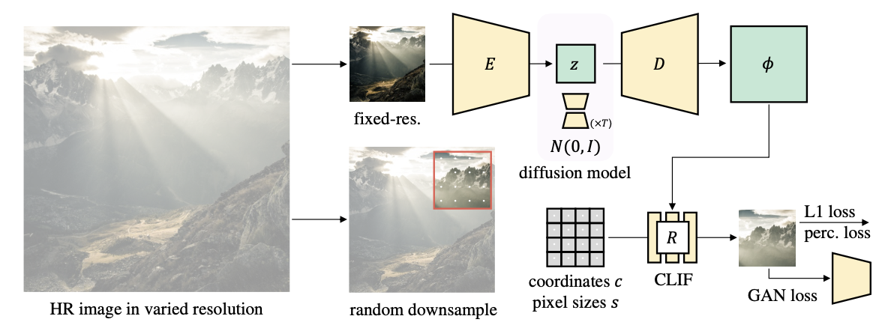

## 关于infd论文



论文是基于已有的LDM。

动机是：目前的LDM模型通常还是生成固定分辨率的图片，如果想要生成高分辨率的图片还要用超分辨率的模块（SR）

改动主要是两点：
- decoder并非直接生成图片，而是产生一个网格场，**基于网格场去生成任意分辨率的图片**
- 基于场的生成会用到渲染器，这个作者之前写的文章是用的所谓的local implicit image
function，取的名字是LIIF，应该就是直接用MLP，这篇文章里换成用卷积网络，叫CLIF，有上下文的feature输入的话，生成的图片或许边界会比较连续？

limitation：
- 论文假设所有图像（无论是低分辨率还是高分辨率）都来自同一分布。如果数据集中低分辨率图像本身质量差（如带噪、模糊），模型可能无法正确生成高质量的高分辨率结果。
- 生成不可控，不可编辑
- 训练也太慢了……

---

## AE训练

使用训练vae的命令

```
CUDA_VISIBLE_DEVICES=0,1 torchrun --standalone --nproc-per-node=2 run.py --cfg cfgs/ae_custom.yaml
```

程序的运行思路主要依赖于两个trainer，通过base_trainer的run方法开启训练过程。

### 初始化过程

主要基于yaml文件的配置内容，向dataset, model的make方法传入args，会有一些分布式训练相关的设置等，这些我没有去细究

**Dataset**
整体而言，dataset是用wrapper_cae包装的image_folder
具体代码流程：

``` python
-> run.py
trainer.run()
-> infd_trainer.py
infd_trainer.run() # 实际调用的是base_trainer.run()
-> base_trainer.py
base_trainer.make_datasets()
for split, spec in cfg.datasets.items():
    # split:{"train", "train_hrft", "val"}
    # spec:{"name", "args":{} , "loader":{}}
    # 其中spec['name']为wrapper_cae
    dataset = datasets.make(spec)
    # 这一步相当于
    # dataset = wraaper_cae(*args)
-> wrapper_cae.py
BaseWrapperCAE.__init__(*args 也就是yaml的args下的一堆参数)
self.dataset = datasets.make(dataset)
# 此处dataset为args.dataset = {"name" = "image_folder", "args" = {"root_path", "resize}}
# 相当于
# self.dataset = image_folder(root_path, resize)
->image_folder.py
ImageFolder.__init__(self, root_path, square_crop=True, resize=None, rand_crop=None):
ImageFolder继承Dataset类，就是比较熟悉的Dataset了，维护了__len__和__getitem__方法
__getitem__会做一些数据增强的工作(resize&crop)

返回阶段
最终trainer的属性中将存储dataset和loader dataset的类型是wrapperCAE
dataset = datasets.make(spec)
self.datasets[split] = dataset
self.loaders[split], self.loader_samplers[split] = self.make_distributed_loader(
    dataset, loader_spec.batch_size, drop_last, shuffle, loader_spec.num_workers)

在从dataset中取data时，将同时调用wrapperCAE和ImageFolder的__getitem__方法
其中wrapperCAE的getitem返回的不单是图片
data = {
    'inp': inp
    'gt': gt_patch, # 3 p p
    'gt_coord': coord, # p p 2
    'gt_cell': cell, # p p 2
}
```

**model**
关于model的建立好像丢了，不过无伤大雅，单纯的装配过程和dataset是一致的。

autoencoder用的是vqgan的架构，不过decoder生成的是网格场，网格场被renderer渲染成图片。
vqgan的架构感觉上和vqvae十分类似，仅仅多了一个discriminator在最后，似乎就是加了一个loss约束
大的框架上就是img->encoder->vector quantizier->decoder->renderer  (with discriminator)
不过在细节的网络搭建上还是有差异的，比如attention的使用这个还没去看，后面看完程序，需要单独来分析一下infd的架构

### 训练流程

实际上是按照LDM的训练方式


