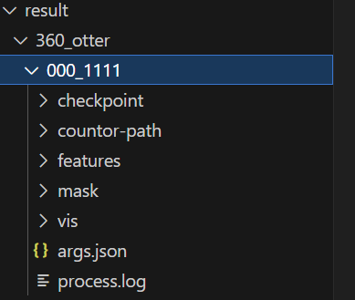

## 功能部分

代码完成的功能是对一张图片进行重建，也就是ShapeLayer里面的forward_single_image函数。
做一个简要的概述就是：

- 对img分层，生成掩码（sorted_shape_layers的生成）
- 勾勒轮廓，三角化，生成mesh，处理mesh

### sorted_shape_layers的生成

sorted_shape_layers的组成是一系列(mean_depth, mask)的tuple 按照mean_depth排序
首先在main函数中定义了两个generator，depth和mask，depth_generator就是生成了一张深度图，mask_generator利用了segmentanything中的SamAutomaticMaskGenerator分割图像、产生掩码，返回的格式需要加以说明

```python
# 把图像分割后，生成一个掩码字典的列表，就是传进process_masks的mask_list
{
    'segmentation': 二维布尔数组（True表示前景）,
    'area': 掩码面积,
    'bbox': [x_min, y_min, width, height],
    'predicted_iou': 质量置信度,
    'stability_score': 稳定性评分,
    'crop_box': 用于生成该掩码的图像区域坐标
}
```
然后用了一个```process_masks(mask_list, threshold1, threshold2, threshold3, threshold4)```函数做了简单处理。
函数的后四个输入对应一些要控制的量：

函数基本就是基于四个量对掩码做一个筛选，然后还考察了没有被掩码覆盖的区域，面积大于500就塞进filtered_mask里面
最后算出每个掩码区域对应的平均深度就可以排序获得**sorted_shape_layers**

### 逐层产生mesh

现在shape_layer的每一层只有掩码，首先的处理是利用函数```make_convex_fore```生成凸包hull，然后将凸包掩码的png文件用vtrace转成svg，再用picosvg优化这个svg文件

接下来就进入get_mesh函数，用svg生成svg_png（那为什么不直接把hull的png传进去呢），然后获取轮廓（轮廓上好多点），最后用triangulate函数生成三角网格，返回mesh，mesh的数据结构用一个MeshFile类规定了

随后mesh会进入一个大函数mesh_process，这个也是有点搞，说实话没太看懂，个人觉得比较重要的部分是把像素点关联到最邻近的三角上，涉及到区分像素点是否落在某个三角内的判断，分出valid和invalid的pixel，然后分别求出对应的三角，
另外是轮廓上之前采样了12个点，这些控制点对某个像素点的控制权重和几何距离成正比
另外附上gpt对return变量的解释，以后参考

```
顶点与颜色数据
vertices: 3D顶点坐标数组，shape为(N,3)
rgb_inmask/rgb_inmask_hull: 遮罩内/凸包区域的像素RGB值，shape为(H,W,3)
遮罩数据
mask/mask_hull: 二值化遮罩矩阵，标识处理区域，shape为(H,W)
in_mask_vertices: 位于遮罩内的顶点子集，shape为(M,3)
几何关联数据
pixel_vertices/pixel_vertices_hull: 每个像素关联的三角形顶点索引，shape为(P,3)
barycentric_coords/barycentric_coords_hull: 像素在三角形内的重心坐标，shape为(P,3)
控制参数
pixel_control_weights: 顶点对像素的控制权重，shape为(P,3)
pixel_vertice_coords: 顶点坐标的插值参数，shape与具体实现相关
索引映射
feature_index_mapper: 字典类型，实现原始顶点索引→特征空间索引的映射
optimized_indices: 需要优化的顶点索引数组
none_optimized_indices: 不需要优化的顶点索引数组
三角形数据
triangles_in_src_mask: 源遮罩区域的三角形索引，shape为(K,3)
triangles_in_hull_mask: 凸包区域的三角形索引，shape为(L,3)
元信息
num_features: 特征空间维度（整型）
num_vertices: 总顶点数（整型）
```


## 文件IO

单张输出如下：


```python
    mask_out_dir = os.path.join(out_dir, "mask")
    features_out_dir = os.path.join(out_dir, "features")
    countor_path_out_dir = os.path.join(out_dir, "countor-path")
    vis_out_dir = os.path.join(out_dir, "vis")

    os.makedirs(mask_out_dir, exist_ok=True)
    os.makedirs(features_out_dir, exist_ok=True)
    os.makedirs(countor_path_out_dir, exist_ok=True)
    os.makedirs(vis_out_dir, exist_ok=True)
```

### mask_out文件夹

首先在处理sorted_shape_layers中的每层掩码时，会首先存储原始的mask,然后对非0层（不知道为什么第0层不生成）的mask生成凸包hull
```python
save_mask(shape[1], os.path.join(mask_out_dir, f"Layer_{j}.png"))
inp = os.path.join(mask_out_dir, f"Layer_{j}_hull.png")
out = os.path.join(countor_path_out_dir, f"Layer_{j}_hull.svg")

mask_hull_j = make_convex_fore(shape[1])
save_mask(mask_hull_j, inp)
```

### countor_path_out文件夹

接着是调用了vtrace和picosvg分别生成了hull的两个svg文件（vtrace的作用应该就是png转svg picosvg似乎是一个优化svg的过程）

```python
res = trace_image(inp, out, args)

out1 = os.path.join(countor_path_out_dir, f"Layer_{j}_hull_scaled.svg")

with open(out1, "w") as output_file:
    result = subprocess.run(
        ["/data1/cy/anaconda3/envs/sam2dam2/bin/picosvg", out],
        stdout=output_file,
        stderr=subprocess.PIPE,
        text=True,
    )
```

接下来就是三角网格生成并保存

```python
mesh = triangulate(all_pts, segments,max_tri_area,layer)
plt_path = svg_path.replace('.svg','.png')
plt.savefig(plt_path)
```

### features文件夹

不知何意味，这和上面存的有什么区别

```python
out_png = os.path.join(features_out_dir, f"Layer_{j}_hull_mask.png")
            out_json = os.path.join(features_out_dir, f"Layer_{j}_hull.json")
mesh_j = MshFile(mesh_j)
mesh_j.visualize(out_png)
```